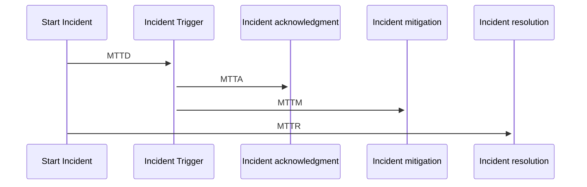

The primary and secondary layers are for resolving and managing incidents.

You need an escalation process for a few reasons.

- interchangeability for any reason (the primary having problem accessing the internet, traveling, oversleeping, etc.)
- nobody responds on primary/secondary, and you need to address this (manager on-call)
- problems that can't be resolved by primary/secondary (security, the legal, executive decision need it)

Testing all escalations is always good, especially with executives who aren't paged often. It is always good if all stakeholders have enough information about current incidents and don't step into the process and ask the Incident commander for information.

It always is good to have reasonable times for escalations. You should calculate times from your SLAs and be sure if someone breaks it, you are still good with including time to escalate. You can always calculate the worst time and expected time for the acknowledged incident (MTTA - Mean Time to Ack), and it's good metrics for how healthy are your paging and if it works.

There are essential metrics for incidents, and those are MTTD (Mean Time to Detect), MTTR (Mean Time to Resolve), MTTM (Mean Time to Mitigate), MTBF (Mean Time Between Failures). Resolve and Detect are the most critical metrics. First, I will focus on detection than resolution. The solution for experienced developers isn't the issue. But have good observability, and looking for the right signals takes a lot of work.

