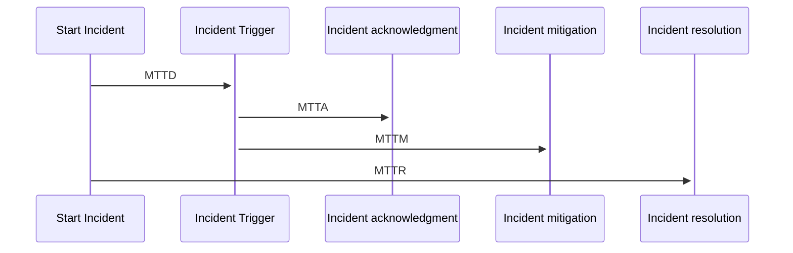

The primary and secondary layers are for resolving and managing incidents.

You need an escalation process for a few reasons.

- interchangeability for any reason (the primary having problem accessing the internet, traveling, oversleeping, etc.)
- nobody responds on primary/secondary, and you need to address this (manager on-call)
- problems that can't be resolved by primary/secondary (security, the legal, executive decision need it)

Testing all escalations is always good, especially with executives who aren't paged often. It is always good if all stakeholders have enough information about current incidents and don't step into the process and ask the Incident commander for information.

It always is good to have reasonable times for escalations. You should calculate times from your SLAs and be sure if someone breaks it, you are still good with including time to escalate. You can calculate both the worst-case and expected time to acknowledge an incident (MTTA — Mean Time to Acknowledge), which is a useful metric for assessing the health of your paging workflow.

## On-call Metrics

The essential metrics for incidents are MTTD (Mean Time to Detect), MTTR (Mean Time to Resolve), MTTM (Mean Time to Mitigate), and MTBF (Mean Time Between Failures). Detection and resolution are the most critical. I will focus first on detection, then resolution. For experienced developers, finding the solution isn't usually the hard part — but having good observability and knowing which signals to look for takes significant effort.

```mermaid
sequenceDiagram
    Start Incident->>+Incident Trigger:MTTD
    Incident Trigger->>+Incident acknowledgment:MTTA
    Incident Trigger->>+Incident mitigation:MTTM
    Start Incident->>+Incident resolution:MTTR
```

## Delivery Metrics

There are other valuable metrics called Four Keys from [DORA](https://cloud.google.com/blog/products/devops-sre/using-the-four-keys-to-measure-your-devops-performance)[^1] [^2].

- Deployment Frequency — How often an organization successfully releases to production

- Lead Time for Changes — The amount of time it takes a commit to get into production

- Change Failure Rate — The percentage of deployments causing a failure in production

- Time to Restore Service — How long it takes an organization to recover from a failure in production

These metrics are about delivery pipelines but support how fast you can recover and deploy fixes, which generally helps on-call.

[^1]: DevOps Research and Assessment (DORA)

[^2]: Four Keys project - https://github.com/dora-team/fourkeys
