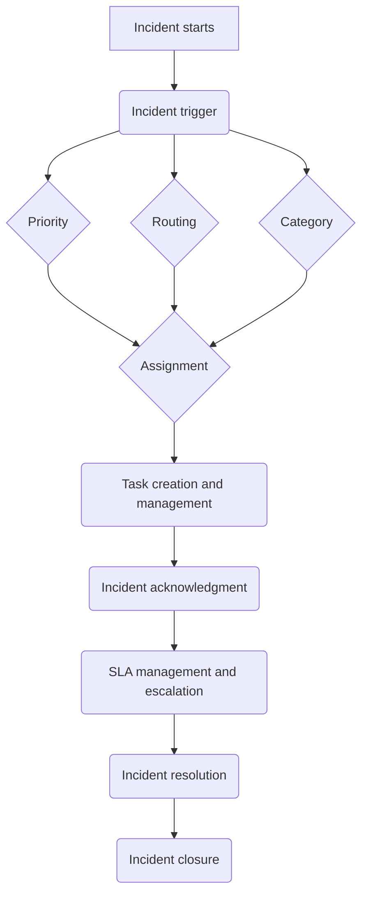

We can split tools into multiple categories as pagers, incident response, incident workflows, utility and postmortems. More and more tools are trying to be more universal and cover more of it. Here is always what suits you best and how you can combine it.

You can find some overview [tools](tools.md) but we will focus more about workflow and what you need.

If you get the incident process as process workflow, you see these essential parts that you need to cover with your tooling.

1. Incident trigger

    - alarms (your observability tooling finds the problem and triggers the pager tool, API, or email)
    - manual (customer or employee finds the problem and files a ticket to investigate, you can have workflow via email, Slack, etc.)

2. Incident routing, categorization, prioritize and assignment

    - make a category if is a ticket or page. You can have a separate category for security or compliance issues
    - you need to set the correct priority. You calculate by your SLO and error budget
    - you can have low and high priority
      - high priority is about waking up the person and try solving the problem right now
      - low priority is about resolving the problem in the next business hours
    - you need to route the incident to the correct team, and the team should have an oncall person assigned by schedule

3. Task creation and management

    - it's good practice to treat every incident as a task in your ticketing system (JIRA, JIRA SD, etc.)

4. Incident acknowledgment

    - you need time to acknowledge that priority. On high priority, you should have 5-15 min. For low priority, you should have 8 hours or the next business day if it is over the weekend

5. SLA management and escalation

    - SLA for tickets and pages are management decision, and it's essential to have that times corresponding to your business case
    - you need an escalation process if something doesn't work as expected. Engineers can miss pager or have problems connecting to the internet
    - engineers on-call should have a way how to escalate decisions to executives. If they have solutions that significantly impact customers or the company, it's not on them to make the decision that can cost millions.
    - similar to security and compliance issues, you should always have a legal and security team to help there

6. Incident resolution

    - mitigate incident is what engineers have to do it first
    - after they mitigate the problem, on-call will deploy the fix and observe that platform is stable
    - then, they will close incident

7. Incident closure

    - you prepare postmortem document
      - their many ways how to do it. What is essential is to make it easy as possible using templates and make it fast soon as possible (the day of the incident or the next day)
    - postmortem review and planning tickets to improve problems that you observe, don't forget deadlines for tickets and review them

## Requirements for pagers

- easy change for people on oncall (oncall market)
- schedule versioning - easy undo changes if make schedule changes
- support for calendar export
- mobile app is useful
- easy way how whitelisting phone numbers for calling to engineers
- support for voice call and sms, not all people using smartphones.
- support for Slack is great, and I will recommend, you can have bot that will answer who have oncall
- good API for your integrations
- the SDK for your favorite language is great!
- reporting is useful as we mention in the previous section.

There are links to documentation how scheduling can look like in OpsGenie and PagerDuty:

- <https://docs.opsgenie.com/docs/on-call-schedules-and-rotations>
- <https://support.pagerduty.com/docs/schedules>

## Requirements for incident response and workflows

- look on integration, covers your tooling (ticketing system, communication tools, status pages, etc)
- security (at least SOC2, ISO 270001 if you need it)
- try have your process before and test it if you model it in tooling, this is very hard to upfront and you will be iterate over process during time and you want have flexibility and support from tooling to do it.
- way how to test it changes properly without breaking current workflows!
- costs (you will pay for all extra tools and their pricing model can't work for everyone)
- help with postmortem to collect all evidence from Slack (or similar tool) to later documentation

## Requirements for postmortems

There is essential to know what you want from postmortems as a company. I prefer to look at postmortems as a way to improve internal processes and as learning materials for newcomers.

- many of tooling are good to have written recoding what happened and how we improve things in the future
- less tools really help with RCA and find important things about your incidents
- you can look on postmortems as materials for learning new people and that is hardest to do it
