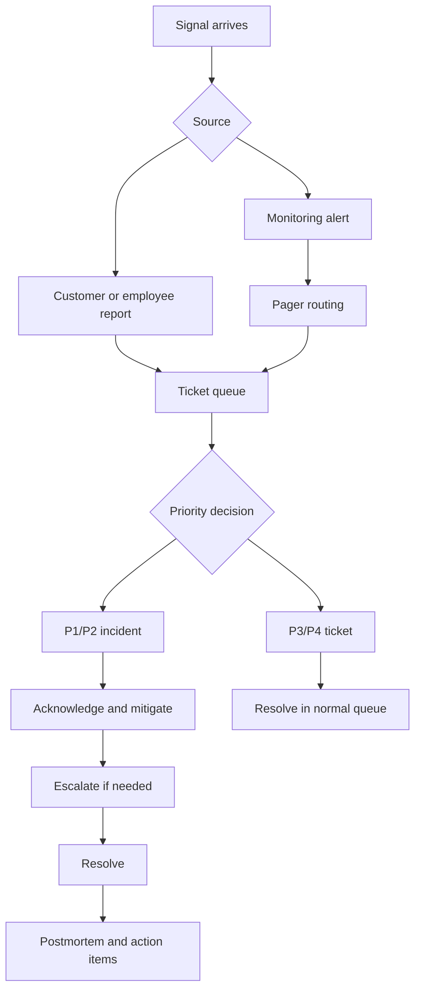

You do not need an expensive incident platform to start. The minimum useful stack is:

- a pager tool, so alerts reach the person currently on-call
- a team chat tool such as Slack, Teams, or Mattermost, so the work has a shared timeline
- a ticketing system with a queue, such as Jira, Jira Service Management, GitHub Issues, Linear, or any tool your team already uses

The ticketing system matters more than people expect. Every alert should create or link to a ticket, even when it is not a major incident. A queue lets the on-call engineer process work in order, preserve context, and hand unresolved items to the next shift. Without a ticket, an alert is just a notification that can disappear.

You can find a vendor overview in the [tools table](tools.md). This chapter focuses on the workflow the tools must support.

```mermaid
flowchart TD
    A[Signal arrives] --> B{Source}
    B --> C[Monitoring alert]
    B --> D[Customer or employee report]
    C --> E[Pager routing]
    D --> F[Ticket queue]
    E --> F
    F --> G{Priority decision}
    G --> H[P1/P2 incident]
    G --> I[P3/P4 ticket]
    H --> J[Acknowledge and mitigate]
    J --> K[Escalate if needed]
    K --> L[Resolve]
    L --> M[Postmortem and action items]
    I --> N[Resolve in normal queue]
```

## Priority and Severity

Priority and severity are related, but they are not the same.

Severity describes the impact: how many customers are affected, whether data is at risk, whether the service is down, whether contractual SLA or compliance obligations may be triggered.

Priority describes the response: whether someone must wake up now, whether the issue can wait for business hours, and which team owns the next action.

This is easier to explain with a severity and priority matrix:

|  | High priority | Low priority |
|---|---|---|
| High severity | Customer checkout is broken. Page now. | Old admin workflow crashes. Fix from the queue. |
| Low severity | Typo on the homepage before launch. Fix quickly, but do not page. | Cosmetic issue. Schedule when possible. |

The exact examples will differ for every company, but the shape is useful. Severity tells you how bad the impact is. Priority tells you how quickly the team must act. OpenStatus has a nice interactive [severity matrix builder](https://www.openstatus.dev/play/severity-matrix) if you want a more detailed runbook example.

A matrix is also useful for compliance. ISO 27001 expects information security events to be assessed and classified before you decide whether they are incidents. SOC 2 and customer audits often look for the same evidence in practice: did you classify the event consistently, choose the response time from documented criteria, and escalate through the right path?

After that, map the matrix into your ticket priorities instead of asking the on-call engineer to improvise under stress:

| Priority | Typical meaning | Response |
|---|---|---|
| P1 | Broad customer impact, production outage, data risk, major security risk, or contractual escalation risk | Page immediately, open incident channel, escalate as needed |
| P2 | Limited customer impact, degraded production service, or high operational risk | Page during coverage hours or immediately if impact is growing |
| P3 | No current customer impact, non-production failure, noisy alert, or operational debt | Create ticket and handle from the queue |
| P4 | Low-risk cleanup, documentation, follow-up, or improvement work | Create ticket, plan normally |

In this model, P1 and P2 are incidents. P3 and P4 are tickets. They still matter, but they should not wake people up unless the risk changes.

If you have multiple environments, use the same tooling for non-production as production. The workflow should be familiar before a real incident. The priority is different: a staging or development alert normally becomes a P3/P4 ticket, not a night page. Exceptions need to be explicit, for example a pre-production environment blocking a release during a critical window.

## Routing and Ownership

Alerts should route to the team that owns the affected service. That sounds obvious, but it requires a maintained service catalog, clear labels in monitoring, and a schedule for each roster.

Every alert should answer three questions:

- Which service or customer path is affected?
- Which team owns the next action?
- Is this a page or a ticket?

If the alert cannot answer those questions, the alert is not ready for production on-call.

## Escalation

Escalation is not only for technical help. The on-call engineer also needs a path for decisions they should not make alone.

Escalate when an incident may involve:

- customer-facing SLA commitments
- public communication or status page updates
- security or privacy impact
- legal, compliance, or audit obligations
- material financial risk
- cross-team ownership conflicts
- vendor or infrastructure provider escalation

Security and compliance cases deserve special handling. Some contracts, regulations, certifications, or internal policies start notification clocks after discovery. The exact timing depends on your obligations, so encode those rules in the escalation policy instead of expecting the engineer on-call to remember them at 2 AM.

## Pager Requirements

A pager tool should support the operating model, not just send notifications. I look for:

- schedule overrides for shift swaps
- escalation policies with acknowledgement timeouts
- primary and secondary rotations
- voice call, SMS, and push notifications
- mobile app support
- phone-number allowlisting guidance, so calls are not blocked
- calendar export
- reporting for pages, acknowledgements, and noisy services
- API access for bots and schedule checks
- integration with the team chat tool

There are examples of scheduling documentation here:

- <https://docs.opsgenie.com/docs/on-call-schedules-and-rotations>
- <https://support.pagerduty.com/docs/schedules>

## Ticketing Requirements

The ticketing tool should give the on-call engineer a queue, not just a place to write notes. It should support:

- automatic ticket creation from alerts
- manual ticket creation from customer or employee reports
- priority fields that match your P1/P2/P3/P4 model
- service, team, and environment labels
- links back to dashboards, alerts, incident channels, and runbooks
- due dates and owners for follow-up work
- reporting by team, priority, environment, and time of day

Jira Service Management is useful because it gives you queues, request types, SLA fields, and triage views. But the exact product is less important than the workflow. If your existing ticketing system can preserve the queue and the ownership rules, use it.

## Incident Workflow Tools

Dedicated incident workflow tools can help once your process is already clear. They usually provide incident channels, roles, timelines, status page updates, stakeholder communication, and postmortem templates.

Do not buy the tool first and then design the process around it. Define and test the process with your team first:

- How is an incident declared?
- Who becomes incident commander?
- Where does communication happen?
- Who updates customers and stakeholders?
- When do legal, security, or executives join?
- How are action items created and tracked after the incident?

Then choose tooling that supports those decisions. Also check whether the tool can be tested safely without breaking live workflows. Incident tooling is operational infrastructure; a bad configuration can page the wrong people or hide urgent work.

## Postmortem Tooling

Most tools can store a timeline and action items. Fewer tools help with RCA and with surfacing what people should learn from the incident later. If you want postmortems to become useful training material for new engineers, the tool needs to preserve the context: Slack messages, timeline events, dashboards, decisions, owners, and follow-up tickets.

That is hard to do manually, but the process matters more than the product. A simple template with strong ownership beats a sophisticated postmortem platform where action items are never reviewed.
