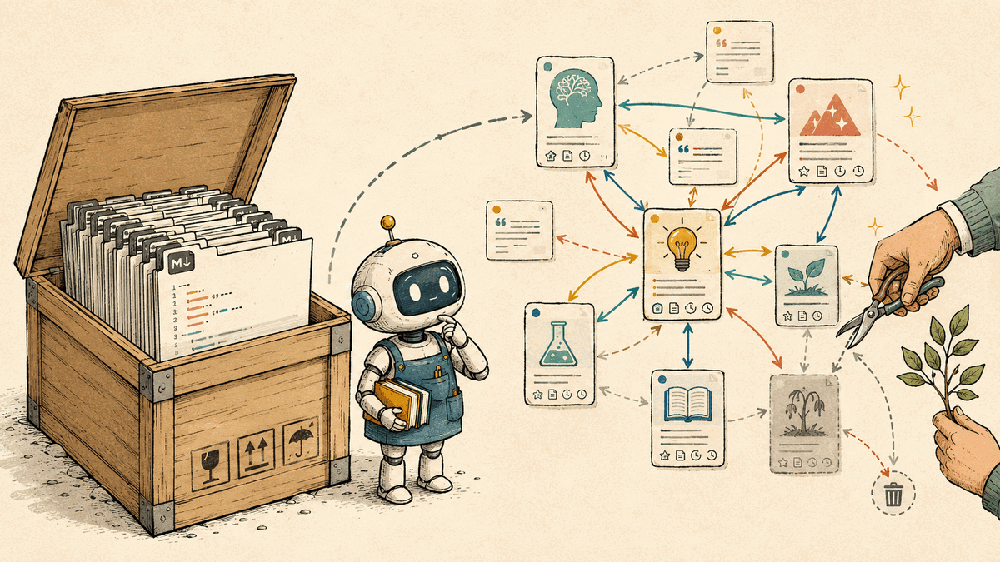

[Google's Open Knowledge Format](https://cloud.google.com/blog/products/data-analytics/how-the-open-knowledge-format-can-improve-data-sharing)
sounded relevant to me immediately. OKF v0.1 is a directory of Markdown files
with YAML frontmatter, stored in Git and readable by people and agents. That is
close to how I already [use Logseq, Codex, and Claude Code](/post/how-i-use-logseq-as-a-personal-knowledge-base/)
with my own knowledge base.

After reading the specification, I do not think I should adopt it. OKF could be
an export format one day, but it leaves out too much of what makes a knowledge
base useful.

First, a correction: OKF is not another markup language. It is a small profile
on top of Markdown and YAML. The required surface is deliberately thin: every
concept is a file, its path is its identity, and its frontmatter must contain a
`type`. Titles, descriptions, tags, resources, timestamps, indexes, logs, and
citations are optional or recommended.

That simplicity is attractive. It also standardizes the least difficult part of
a knowledge system.

## Backlinks are part of the data model

OKF defines a link from concept A to concept B as a directed, untyped edge. The
meaning, such as "depends on", "references", or "joins with", stays in the
surrounding prose. A consumer may scan the bundle and compute the reverse edge,
but the format does not require it.

This distinction matters. In Logseq, a backlink is not decoration in a graph
view. When I open B, I can see every page that mentions B, including connections
I did not remember to encode on B itself. The forward link records what the
author of A knew. The backlink shows how the rest of the corpus has accumulated
around B.

Adding an explicit link from B back to A is not the same thing. It duplicates
the edge and may misstate the relationship: "A references B" does not imply "B
references A". It also creates a synchronization problem when pages move or
relationships change.

An OKF consumer can reconstruct backlinks. Google's reference visualizer does
this and presents them as "Cited by". But another consumer can ignore reverse
links and still conform to the specification. Both tools support the same format
while exposing materially different knowledge bases.

## Conformance does not imply shared meaning

The rest of the interoperability contract is similarly thin. `type` is the only
required field, but type names are not registered. Consumers must tolerate
unknown values. Links are untyped. Citations are recommended rather than
required. Broken links are explicitly permitted.

These are sensible choices for a forgiving file exchange format. They also mean
that two conformant bundles can agree on syntax while disagreeing on nearly all
of the semantics. One producer's `Playbook` may not resemble another's. A
consumer can parse both files without knowing how to compare, validate, or use
them.

That is portability of text. It is not yet portability of knowledge.

## We already have document formats

If the problem is how to store rich, readable technical documents in plain text,
we already have mature options.
[reStructuredText](https://docutils.sourceforge.io/docs/ref/rst/restructuredtext.html)
has field lists, citations, hyperlink targets, directives, and
[extensible interpreted-text roles](https://docutils.sourceforge.io/docs/ref/rst/roles.html).
AsciiDoc has [document attributes](https://docs.asciidoctor.org/asciidoc/latest/attributes/document-attributes/),
[document-to-document cross-references](https://docs.asciidoctor.org/asciidoc/latest/macros/inter-document-xref/),
and [includes](https://docs.asciidoctor.org/asciidoc/latest/directives/include/).

Neither format gives every tool Logseq-style backlinks automatically. That is
the point: backlinks are a corpus-level index and navigation contract, not an
inline-markup feature. Putting YAML in front of Markdown does not solve that
layer either.

Markdown plus YAML is a reasonable transport choice with modest parsing
requirements. But choosing a transport is different from defining a knowledge
architecture. If a team prefers AsciiDoc or reStructuredText, it should not need
to convert its source documents just to participate in a knowledge exchange. A
useful standard could define concepts, identifiers, relationships, provenance,
and lifecycle independently, then provide mappings for several text formats.

## Markdown is the least interesting part of my knowledge base

My setup works because it is selective. Journals are a raw inbox. External
sources are retained locally when needed. Durable pages are synthesized rather
than copied. Claims carry source notes with searchable anchors. A curation log
records what was promoted, skipped, or left for later. Every page edit is
reviewed against its sources instead of trusted because the prose sounds
coherent.

None of that follows from the file extension.

A directory can be perfectly conformant with OKF and still be a bad knowledge
base: duplicated notes, stale claims, missing provenance, disconnected pages,
and generated summaries nobody has checked. An agent can parse the corpus, but
parsing is not the same as trusting or navigating it.

For me, a stronger interchange model would need at least:

- stable concept identifiers that survive file moves
- standardized backlink or reverse-edge behavior
- relationship types that consumers can understand without reading prose
- claim-level provenance, not only an optional citations section
- a way to distinguish raw capture, durable synthesis, and deprecated material
- mappings for existing systems and formats instead of one mandatory source syntax

This does not all need to live inside every document. A manifest or generated
graph index may be better than duplicating metadata across files. The important
part is that the behavior belongs to the contract, so each consumer does not
invent it again.

## Where OKF could still fit

OKF may become useful as a lowest-common-denominator export. If an agent or
catalog I want to use accepts OKF, a Logseq plugin could map page properties to
YAML, convert wiki links to Markdown links, and generate a backlink index. My
knowledge base would remain the source of truth.

I would not build that adapter before there is a consumer worth using. OKF is
still a v0.1 draft, and changing a working knowledge base to satisfy a thin
interchange profile would add maintenance without improving the knowledge.

The problem is real: agents need portable context, and knowledge should not be
locked inside one vendor's catalog. But a collection of readable files is only
the substrate. A great knowledge base also needs relationships, provenance,
selection, and maintenance. Another file profile does not provide those by
itself.

## Sources

- Google Cloud, [*Introducing the Open Knowledge Format*](https://cloud.google.com/blog/products/data-analytics/how-the-open-knowledge-format-can-improve-data-sharing) (2026-06-12)
- [Open Knowledge Format v0.1 draft specification](https://github.com/GoogleCloudPlatform/knowledge-catalog/blob/main/okf/SPEC.md)
- [Open Knowledge Format reference implementation and visualizer](https://github.com/GoogleCloudPlatform/knowledge-catalog/tree/main/okf)
- Docutils, [*reStructuredText Markup Specification*](https://docutils.sourceforge.io/docs/ref/rst/restructuredtext.html)
- Docutils, [*reStructuredText Interpreted Text Roles*](https://docutils.sourceforge.io/docs/ref/rst/roles.html)
- Asciidoctor, [*Document Attributes*](https://docs.asciidoctor.org/asciidoc/latest/attributes/document-attributes/)
- Asciidoctor, [*Document to Document Cross References*](https://docs.asciidoctor.org/asciidoc/latest/macros/inter-document-xref/)
- Asciidoctor, [*Includes*](https://docs.asciidoctor.org/asciidoc/latest/directives/include/)
