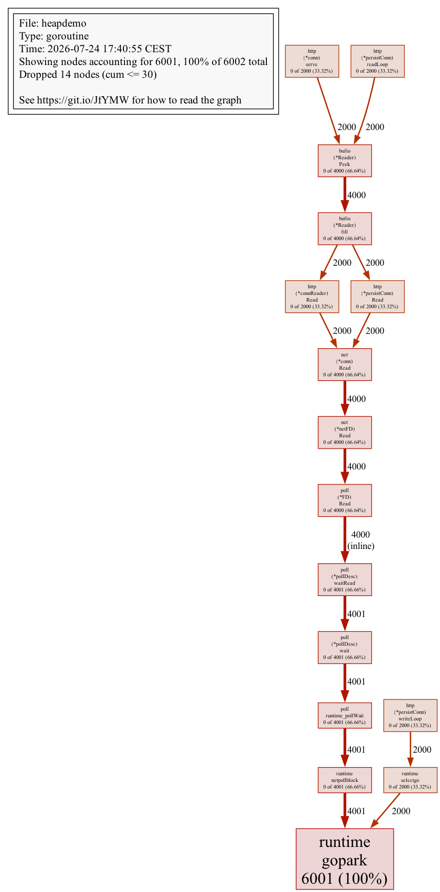
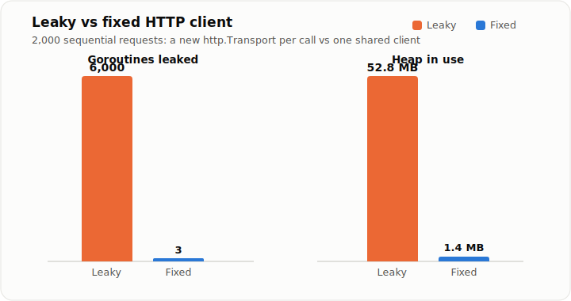

Go has a garbage collector, so people assume they can't leak memory. You can. The collector frees memory that is no longer reachable, but nothing stops you from holding a reference forever, or from spawning goroutines that never exit. Both keep memory alive, and the graph creeps up until the process hits its limit and gets killed.

We recently chased one of these in a service that talks to a lot of backends. Memory climbed slowly over hours, dropped when the pod was OOM-killed, and climbed again. The classic sawtooth. This post walks through what a leak looks like in Go, how to dump the heap and read it with `pprof`, and the actual fixes we shipped.

## What a memory leak looks like in Go

There is no `free()` to forget in Go. A "leak" is really one of two things:

- **Retained references.** Something reachable still points at memory you are done with: a map that only grows, a slice that pins a large backing array, a cache with no eviction.
- **Leaked goroutines.** A goroutine that blocks forever, or a loop that never returns, keeps its whole stack and everything it captured alive. This is the one people forget, because it doesn't look like memory at all.

The tell is the shape of the graph. A leak grows *monotonically* and never fully recovers after a GC. A healthy service sawtooths inside a stable band; a leaking one sawtooths around a rising baseline until it hits the memory limit. In Kubernetes that ceiling is the cgroup limit, and crossing it is an OOM kill, not a friendly error.

## Dumping the heap with pprof

Go ships the tooling you need in the standard library. Register the `net/http/pprof` handlers and expose them on a local port:

```go
import (
	"log"
	"net/http"
	_ "net/http/pprof" // registers /debug/pprof/* on the default mux
)

func main() {
	go func() {
		log.Println(http.ListenAndServe("localhost:6060", nil))
	}()

	// ... the rest of your service
}
```

Now you can pull profiles. The two that matter for a leak are `heap` (what memory is live) and `goroutine` (how many goroutines exist and where they are stuck):

```bash
# interactive heap profile
go tool pprof http://localhost:6060/debug/pprof/heap

# goroutine profile
go tool pprof http://localhost:6060/debug/pprof/goroutine
```

Inside `pprof`, `top` shows the biggest allocators, `list <func>` shows line-level allocation, and `web` draws a call graph (needs Graphviz). By default the heap profile shows `inuse_space`, the memory live right now, which is what you want for a leak. `alloc_space` shows total allocations over time, which is better for allocation churn and GC pressure.

The single most useful trick for a *slow* leak is to diff two snapshots. Grab one, wait, grab another, and compare:

```bash
curl -s http://localhost:6060/debug/pprof/heap -o heap1.pb.gz
# wait a while under load
curl -s http://localhost:6060/debug/pprof/heap -o heap2.pb.gz

go tool pprof -base heap1.pb.gz heap2.pb.gz
```

Whatever grew between the two snapshots is your suspect. For goroutine leaks the diff is even simpler, the count itself:

```bash
curl -s "http://localhost:6060/debug/pprof/goroutine?debug=1" | head -1
# goroutine profile: total 5231
```

If that number climbs and never comes back down, you have a goroutine leak, and the stack traces in the full profile (`debug=2`) tell you exactly where they are parked.

Here is that goroutine profile as a graph, after 2,000 requests through a client that builds a new transport every call. Every one of those goroutines is a `persistConn` read or write loop (plus the server side) parked in `runtime.gopark`, waiting on a connection that will never be touched again:



## The real fixes

Our leak came from HTTP and gRPC client lifecycle. Here are the three patterns we fixed, generalized out of the actual code.

### 1. Build the client once, reuse it

The bug: a fresh `http.Transport` was created on every call. Each `Transport` owns a connection pool and runs background goroutines to manage those connections. Create one per request and you get a new pool and new goroutines every time, and the `Transport` cannot be garbage-collected while its goroutines are alive.

```go
// Leaky: a new Transport (and its pool + goroutines) on every call.
func (c *Client) fetch(ctx context.Context, url string) (*http.Response, error) {
	tr := &http.Transport{}
	client := &http.Client{Transport: tr}
	return client.Get(url)
}
```

The fix is boring and correct: construct one client, store it, share it. `http.Client` and `http.Transport` are safe for concurrent use by design, and reusing them is also what lets connection pooling actually work.

```go
type Client struct {
	httpClient *http.Client
}

func NewClient() *Client {
	return &Client{
		httpClient: &http.Client{
			Timeout: 10 * time.Second,
			Transport: &http.Transport{
				MaxIdleConns:        100,
				MaxIdleConnsPerHost: 2,
				IdleConnTimeout:     90 * time.Second,
			},
		},
	}
}

func (c *Client) fetch(ctx context.Context, url string) (*http.Response, error) {
	req, err := http.NewRequestWithContext(ctx, http.MethodGet, url, nil)
	if err != nil {
		return nil, err
	}
	return c.httpClient.Do(req)
}
```

While we were in there, we also fixed the ticker loops that fed those calls. A `time.Ticker` that is never stopped, in a loop that never returns, is a goroutine leak:

```go
// Leaky: the goroutine and the ticker live forever.
func (w *Worker) run() {
	ticker := time.NewTicker(30 * time.Second)
	for range ticker.C {
		w.sync()
	}
}
```

Make the loop honor a context and stop the ticker on the way out:

```go
func (w *Worker) run(ctx context.Context) {
	ticker := time.NewTicker(30 * time.Second)
	defer ticker.Stop()
	for {
		select {
		case <-ctx.Done():
			return
		case <-ticker.C:
			w.sync()
		}
	}
}
```

### 2. Release idle connections on teardown

When a client genuinely is short-lived, spun up for one job and then discarded, close its idle connections in the cleanup path so the sockets and their goroutines go away instead of lingering:

```go
func (c *Client) Close() {
	c.httpClient.CloseIdleConnections()
}
```

### 3. Bound the pool and close gRPC clients

Any bare `http.Transport` should have limits so idle connections age out instead of accumulating. `IdleConnTimeout` closes connections that sit unused, and `MaxIdleConnsPerHost` caps how many you keep around per backend (the default of 2 is low, so raise it deliberately if you talk to a few hosts a lot):

```go
tr := &http.Transport{
	IdleConnTimeout:     90 * time.Second,
	MaxIdleConnsPerHost: 2,
}
```

gRPC has the same lifecycle trap. A `grpc.ClientConn` runs background goroutines for its connection management; if you create one per operation and never close it, they pile up. Close it when you are done:

```go
conn, err := grpc.NewClient(target, opts...)
if err != nil {
	return err
}
defer conn.Close()
```

For long-lived gRPC clients the rule flips: create the connection once and share it, exactly like the HTTP client above. The failure mode is the same either way: a connection object whose goroutines outlive its usefulness.

## Other common causes worth knowing

Client lifecycle was our bug, but these are the leaks I see most often in Go, and all of them show up the same way in `pprof`:

- **Unbounded caches and maps.** A `map` that only ever grows is a leak with extra steps. Add eviction or a size bound.
- **`defer` inside a long loop.** `defer` runs when the *function* returns, not the iteration. Deferring `Close()` inside a loop that processes ten thousand items keeps all ten thousand handles open until the end. Close explicitly, or wrap the body in its own function.
- **Slices that pin a big backing array.** `return data[5:10]` keeps the entire underlying array alive, not just the ten bytes you sliced. If `data` was a 10 MB file, you just leaked 10 MB to hold ten bytes. `bytes.Clone` (or an explicit copy) breaks the link.
- **Goroutines blocked on a channel nobody writes to.** They wait forever, holding their stack and captured variables. A context or a bounded timeout gives them a way out.

## Two Go internals worth a note

While tuning the hot path, two details are worth keeping in mind. The first is that `http.DefaultTransport` is a bit of a trap: it is typed as `RoundTripper` but is really an `*http.Transport`, so customizing it means an unsafe type assertion and a clone (`http.DefaultTransport.(*http.Transport).Clone()`). `Clone()` is also the clean way to get one configured transport to share rather than hand-rolling per-call ones. Anton Zhiyanov has [a good writeup of that design wart](https://antonz.org/default-transport/).

The second is escape analysis. The compiler decides whether a value lives on the stack (cheap, freed automatically) or escapes to the heap (GC's problem). Returning a pointer to a local, capturing a variable in a goroutine, or boxing into an interface all push a value to the heap. You can see the decisions with `go build -gcflags="-m"`, but only chase this on hot paths. Not every escape is a problem, and most are fine.

## Takeaways

Go's garbage collector handles memory you stop referencing. It cannot help with references you keep or goroutines that never exit, and connection pools are both at once. When memory climbs and won't come back down:

1. Expose `net/http/pprof` and diff two heap snapshots with `go tool pprof -base`.
2. Watch the goroutine count, because a rising count is a leak you can't see in the heap alone.
3. Build clients (HTTP and gRPC) once and reuse them; give every ticker and goroutine a context to exit on; close the short-lived ones explicitly.

I put the leaky and fixed clients, the goroutine-leak tests, the benchmark, and the pprof graphs into a runnable repo: [github.com/abtris/go-http-transport-leak](https://github.com/abtris/go-http-transport-leak). Running 2,000 requests through each client shows the gap:



Same workload, same server. The only difference is whether the transport is built once or per call. `make graphs` in the repo regenerates the profiles yourself.

If you want the companion piece on getting the *timeouts* right on those same clients, I wrote about [basic HTTP client settings in Go](/post/watch_out_for_basic_http_client_settings_in_go/) earlier. For a deeper reference on detection, Datadog's [guide to Go memory leaks](https://www.datadoghq.com/blog/go-memory-leaks/) and JetBrains' [escape analysis explainer](https://blog.jetbrains.com/go/2026/07/20/escape-analysis/) are both worth a read.
