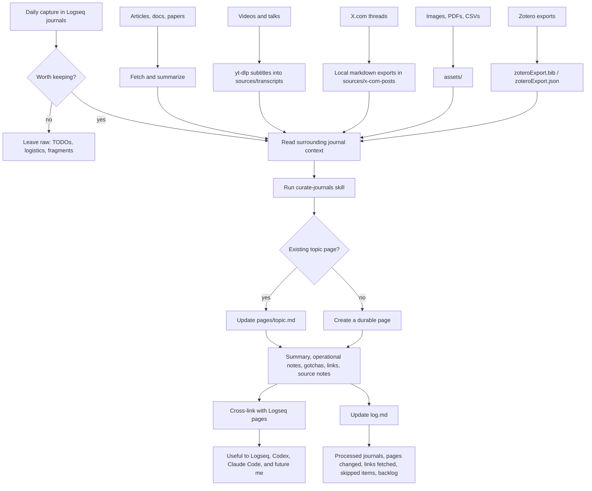
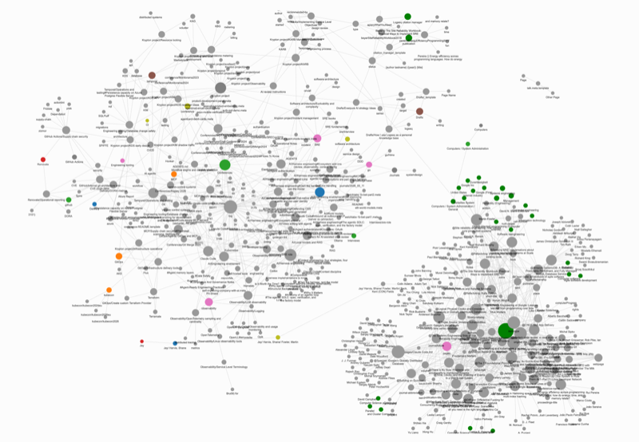

This setup was inspired by Andrej Karpathy's [LLM Wiki](https://gist.github.com/karpathy/442a6bf555914893e9891c11519de94f),
but my version is deliberately local and boring: Logseq journals as the inbox,
source files as the archive, and compact pages as the durable layer.

Google is making a similar argument with [Open Knowledge Format](https://cloud.google.com/blog/products/data-analytics/how-the-open-knowledge-format-can-improve-data-sharing):
[Markdown](https://spec.commonmark.org/) plus [YAML front matter](https://jekyllrb.com/docs/front-matter/)
as a shareable knowledge format. I think the format is the easy part.
[Markdown](https://spec.commonmark.org/), [reStructuredText](https://docutils.sourceforge.io/rst.html),
[AsciiDoc](https://docs.asciidoctor.org/asciidoc/latest/), or any plain text
format with metadata can work. For company-wide use, the harder part is the
documentation pipeline: how you ingest sources from different places, keep them
fresh, and assign curators, human or LLM, to maintain the useful layer.

My Logseq graph is not where every thought becomes permanent. It is where raw
material waits until I decide whether it deserves a second life.

The split in this repository is blunt:

- `journals/` is the raw inbox.
- `sources/` is where bulky external material lives.
- `pages/` is the durable knowledge layer.
- `log.md` is the audit trail of curation work.

Day to day, that is not formal. I capture links, screenshots, meeting fragments,
commands, papers, talks, and half-formed notes into Logseq journals. Later, I run
a curation pass and promote only the material I expect to search for again.

## The flow



## Journals are the inbox

Daily journals are intentionally messy. They contain:

- links I may or may not read later
- meeting scraps
- debugging notes
- command fragments
- screenshots
- TODOs
- short observations
- notes for work projects

I do not try to make journals beautiful. If I had to polish every note at
capture time, I would capture less.

The rule is that journals are source material, not the knowledge base.
Most journal bullets should never be promoted. TODO-only items, meeting
logistics, unexplained fragments, and one-off status updates usually stay where
they are.

What gets promoted is the material with reuse value:

- architecture decisions
- operational patterns
- incident/debugging lessons
- recurring themes
- commands with explanation
- glossary terms
- papers, talks, docs, and articles worth finding again

## External sources need a local copy

Some source material is too large, too valuable, or too likely to disappear
behind a login wall. The graph has a `sources/` directory for that.

For conference talks, I fetch subtitles with `yt-dlp` and store `.vtt` files under
`sources/transcripts/<conference>-<year>/`. Each talk gets a small metadata file
with the URL, title, speakers, runtime, transcript path, and the page that
summarizes it.

The summary goes into `pages/`. The transcript stays in `sources/` so future
search can still find an exact phrase, command, or speaker quote that did not
make the summary.

X.com needs a different path because direct fetching is unreliable from this
workspace. Long posts and threads are exported locally as Markdown into
`sources/x-com-posts/`. The stable join key is the numeric status ID. When a
journal has an X link, I grep the exports for that ID and cite the local file.

Attachments such as screenshots, PDFs, CSVs, and images live in `assets/`, using
Logseq's normal local asset links.

The result is boring in a useful way: a broken website or login wall does not
erase the source trail.

## Pages are the knowledge layer

The durable pages are compact Markdown notes. They are not dumps from journals.
They answer the questions I expect a future reader, including a future AI agent,
to ask:

- What is this?
- Why does it matter?
- How does it work?
- What are the gotchas?
- Where did this come from?

The common shape is:

- `## Summary`
- `## Key Ideas`
- `## Operational Notes`
- `## Gotchas`
- `## Links`
- `## Source Notes`

Not every page needs every heading. The format is only there to force the useful
work: make the page searchable, connect it to related pages, and show where the
material came from.

A recent addition to that shape is claim-level footnotes. `## Links` is a fine
roster of further reading, and `## Source Notes` records which journal a page
grew from, but neither tells a reader which specific source backs a specific
sentence. When a page states a number, a benchmark result, or a direct
attribution, I now tie it to its source with a footnote at the point of the
claim, so the reader lands on the primary source instead of guessing which of
ten links in the list is the right one. Logseq renders standard Markdown
footnotes: `[^1]` next to the claim, and `[^1]: Title, date, URL` collected at
the bottom of the page. The `curate-journals` skill treats this as a rule now:
any paper, post, or video a page relies on has to be reachable from the page
itself, because the journal it came from usually holds only a bare link.

Logseq links are the connective tissue. A page about local models can point to
`[[Claude Code]]`, `[[AI/Harness engineering]]`, or `[[Observability/LLM observability]]`
without needing a separate taxonomy project. If a page name contains a slash,
the file uses Logseq's triple-lowbar encoding, so `AI/Local models and RAG`
lives as `pages/AI___Local models and RAG.md`.

## The curation pass

The curation workflow is deliberately mechanical:

The repo has a Claude skill for this: `.claude/skills/curate-journals/SKILL.md`.
`AGENTS.md` says what the graph is and what good curation looks like; the skill
turns that into the repeatable pass.

1. Find unprocessed journal changes from the last `Curation hash:` in `log.md`,
   plus any untracked journal files.
2. Read each journal in full and note the `[[tag]]` blocks.
3. Classify each bullet as durable, raw, or already promoted.
4. Map durable items to existing pages before creating new pages.
5. Investigate external links, transcripts, and local X.com exports.
6. Write synthesis into `pages/`, not a dump of journal bullets.
7. Cross-link related pages.
8. Append a new batch entry to `log.md`.
9. Update `pages/contents.md` if a new durable page was created.

The last step saves future work. `log.md` records which journals were processed,
which pages changed, which external links were investigated, which videos or
transcripts were fetched, what was skipped, and what backlog remains.

That makes curation resumable. A later pass can see why a link was ignored or
whether a conference playlist was already fetched.

The git hash is the part that makes this work for real daily notes. A date scan
only finds journal files newer than the last processed date. That misses the
normal Logseq habit: I open an old day, add one new block, and save it. The
`curate-journals` skill reads the previous `Curation hash:` and diffs
`journals/` against it, so a re-edited `journals/2026_06_24.md` shows up even if
`journals/2026_06_25.md` was already processed.

The pass starts with roughly this:

```sh
git diff --name-only <stored-hash> HEAD -- journals/
git status --short journals/
```

The union is the work list: journal files changed since the last curation pass,
plus new untracked journals. The curation log then records the next hash so the
following pass has a new high-water mark.

The skill also keeps the pass conservative. It explicitly says to leave TODOs,
meeting logistics, PR breadcrumbs, isolated IDs, and ungrounded fragments in the
journal. That matters because the easiest way to ruin a personal knowledge base
is to promote everything.

## Agents make the graph more useful

This graph is written for humans, but I also expect coding agents to read it.

The repository has explicit instructions for Codex and Claude Code. They say,
in effect: this is a private Logseq knowledge base, not an app repo; journals
are the raw inbox; pages are the durable layer; do not copy raw fragments into
pages; synthesize, cite sources, and keep sensitive details private.

For journal work, the agent loads `curate-journals` and follows the same checklist
every time. That gives the agent a smaller job than "organize my notes": find the
new journal material, decide what has durable value, update the right page, and
write down what happened.

That changes how I use AI tools. Instead of asking an agent to remember context
from a chat, I ask it to inspect the repo:

- search journals for a topic
- find the existing page
- read source notes
- summarize a talk transcript
- connect related pages
- draft a post from the durable layer

The agent does not need everything pasted into the prompt. It can search the
repository, read the source material, and leave behind better Markdown for the
next run.

## What I do not promote

The part that keeps the system usable is omission.

I do not move every note into `pages/`. Most raw material stays raw. That keeps
the durable layer useful.

I leave behind:

- tasks without reusable context
- meeting logistics
- temporary debugging noise
- private operational details that do not need to be repeated
- links that looked interesting but did not turn into a durable idea
- source material that I cannot verify

The durable layer works because it is selective.

## The result

I am not trying to build a perfect wiki. I want a working memory system with:

- fast capture in journals
- source retention for long-form material
- compact durable pages
- explicit source notes
- a curation log
- enough structure for Logseq, Codex, Claude Code, and future me to navigate it

The design choice is to treat personal knowledge as ingestion, not filing.
Capture stays cheap because journals can stay messy. Curation happens later,
when there is enough signal to write a page worth keeping.

That delay is the trick. It keeps the inbox easy and the knowledge layer clean
enough to be useful months later.


